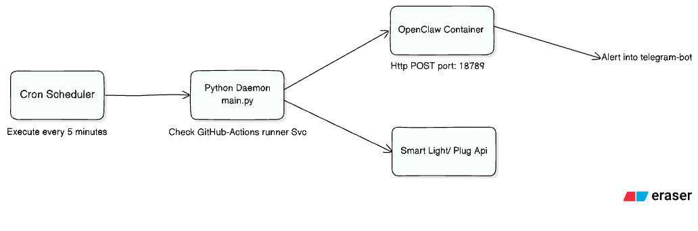

# Automated Server & Deployment Monitoring System

A self-hosted, lightweight monitoring daemon for Ubuntu Mini PC servers. It automatically detects system anomalies—such as a crashed GitHub Actions self-hosted runner or a stuck deployment—and triggers digital notifications via Telegram (through an OpenClaw gateway container) and physical alerts via local smart home devices (smart lights or plugs).

---

## Architecture & System Overview



### Components

1. **Local Development & Deployment Workflow (`macOS` -> `GitHub` -> `Ubuntu`)**:
   - Developed on macOS with VS Code.
   - Pushed to GitHub repository. `.gitignore` keeps sensitive files (`.env`), Python environments (`.venv/`), and volume storage (`openclaw_data/`) out of version control.
   - Deployed on Ubuntu Mini PC via `git pull origin main`.

2. **Configuration Layer (`config.py` & `.env`)**:
   - `OPENCLAW_WEBHOOK_URL`: Points to local OpenClaw gateway (`http://localhost:18789/hooks/agent`).
   - `OPENCLAW_HOOK_TOKEN`: Shared secret authorization token for webhook requests.
   - `SMART_LIGHT_API_URL`: Local endpoint for home automation visual notifications.
   - `MAX_DEPLOY_MINUTES`: Threshold in minutes before flagging stuck deployments.

3. **Monitoring Core (`main.py`)**:
   - Checks status of GitHub Actions self-hosted runner via `sudo ./svc.sh status`.
   - Dispatches structured HTTP alerts with timestamp and error message to OpenClaw.
   - Triggers smart light/plug endpoint concurrently.

4. **OpenClaw Gateway Container (`docker-compose.yml` & `openclaw.json`)**:
   - Runs persistently on port `18789`.
   - Mapped volume `./openclaw_data` preserves persistent container configuration.

---

## Setup & Deployment Guide

### 1. Prerequisites (Ubuntu Server)
- Python 3.10+ & `python3-venv`
- Docker & Docker Compose
- GitHub Actions self-hosted runner configured at `/home/minipc/actions-runner`

### 2. Initializing Virtual Environment & Dependencies
```bash
git clone <repository-url> server-monitor
cd server-monitor

# Create virtual environment
python3 -m venv .venv
source .venv/bin/python

# Install dependencies
pip install -r requirements.txt
```

### 3. Environment Configuration
Copy `.env.example` to `.env` and fill in your secrets:
```bash
cp .env.example .env
```
Edit `.env`:
```env
OPENCLAW_WEBHOOK_URL=http://localhost:18789/hooks/agent
OPENCLAW_HOOK_TOKEN=your-openclaw-shared-secret-token
SMART_LIGHT_API_URL=http://<smart-light-ip>/api/turn_on
MAX_DEPLOY_MINUTES=15
```

### 4. OpenClaw Gateway Container Setup
Create `openclaw_data/openclaw.json` (refer to `openclaw.json.example`):
```bash
mkdir -p openclaw_data
cp openclaw.json.example openclaw_data/openclaw.json
# Edit openclaw_data/openclaw.json with your Telegram Bot Token and Chat ID
```

Spin up the gateway container:
```bash
docker compose up -d
```

### 5. Automated Health Checks via Linux Cron
Configure Linux `cron` to execute the monitoring script every 5 minutes:
```bash
crontab -e
```
Add the following entry:
```cron
*/5 * * * * /home/minipc/server-monitor/.venv/bin/python /home/minipc/server-monitor/main.py >> /home/minipc/server-monitor/cron.log 2>&1
```

---

## Testing & Verification

Run the script manually to verify configuration validation and runner checks:
```bash
/home/minipc/server-monitor/.venv/bin/python main.py
```
